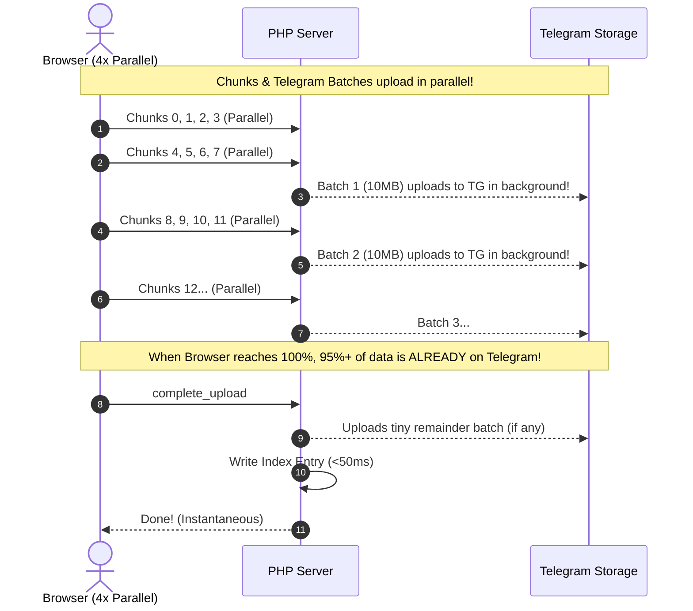

# Implementation Plan: Continuous Pipelined Streaming (Instant Final Save <0.2s)

Eliminate the delay during the final *"Saving to Telegram Storage Cloud..."* step by uploading 10MB batches to Telegram **in the background continuously while chunks are arriving**.

---

## Why the Delay Happened

Previously:
1. Browser uploaded all chunks to the server disk.
2. Only after 100% of chunks arrived did `complete_upload` start pushing everything to Telegram.
3. For a 180MB file, uploading all 180MB to Telegram at the very end took 15–25 seconds of waiting.

---

## The Solution: Continuous Overlapped Pipeline

### Key Technical Improvements

1. **Pipelined Background Batch Processing (`api/index.php`):**
   - In `files.upload_chunk`: As chunks arrive, a thread-safe lock (`flock`) checks for contiguous chunks.
   - Every time 10MB of contiguous parts are ready, the server merges them and streams the batch to Telegram immediately.
   - The Telegram `file_id` and metadata are recorded in `session_chunks.json` in real-time.
   - Local temp chunk files are deleted immediately.

2. **Instant Finalization (`files.complete_upload`):**
   - By the time the user's browser hits 100%, nearly all batches are **already stored in Telegram**.
   - `complete_upload` only uploads any remaining small tail batch, registers the index entry, and returns in **< 200 milliseconds**.

3. **Smooth UI Progress (`assets/frontend/app.js`):**
   - Update status indicators to show live pipelined activity:
     - e.g., `Uploading • 15.2 MB/s (Streaming to Telegram in background)`
     - When client upload finishes, the final indexing completes in a blink.

---

## Proposed Changes

| File | Changes |
|---|---|
| [`api/index.php`](file:///Users/rahulkumar/Desktop/TeleDrive/api/index.php) | Implement thread-safe continuous batch aggregation & background streaming in `upload_chunk`; make `complete_upload` instant. |
| [`assets/frontend/app.js`](file:///Users/rahulkumar/Desktop/TeleDrive/assets/frontend/app.js) | Update progress status text to reflect continuous background streaming. |

---

## Verification Plan

### Automated / Syntax Check
- Verify PHP syntax: `php -l api/index.php`.

### Real-World Upload Verification
- Upload the 180MB `.wpress` file:
  - Watch Telegram Storage Channel receive batches *during* the upload, not just at the end.
  - Confirm the final "Completed!" notification triggers **instantly (< 0.5s)** once the progress bar hits 100%.
  - Verify file integrity and download streaming.
