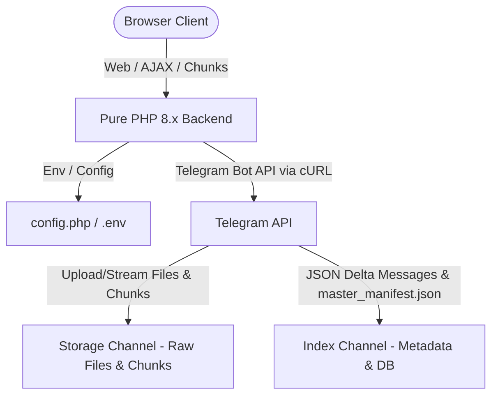

# TeleDrive-PHP Implementation Plan

A lightweight, zero-database Telegram Cloud File Manager built with Pure PHP 8.x and HTML5/CSS3/Vanilla JavaScript (No Frameworks, No Docker, No MySQL/SQLite).

---

## Architecture & System Overview



### Key Components

1. **Zero-Database Engine**: Telegram channels act as both the object storage and NoSQL document store.
2. **50-Message Compaction / Checkpointing**:
   - Every file upload or folder creation posts a JSON message into the **Index Channel**.
   - When 50 delta messages accumulate since the last checkpoint:
     - The pinned `master_manifest.json` document is fetched from the Index Channel.
     - Merged with the 50 new delta entries.
     - Uploaded as a new `master_manifest.json` document to the Index Channel.
     - Pinned using `pinChatMessage` (and old pinned message is deleted/unpinned).
   - On directory loading: Reads only the pinned `master_manifest.json` + delta messages after it for lightning-fast (<1s) load times.
3. **Chunking & Multipart Upload/Streaming**:
   - Frontend chunks files (e.g. in 20MB-50MB chunks) to circumvent PHP/server `upload_max_filesize` limits.
   - For files > 2GB (Telegram Bot API limit), backend manages multipart storage chunks in the Storage Channel.
   - File download streams Telegram parts continuously through output buffers (`php://output`) directly to the browser.
4. **CRUD & Cascade Management**:
   - Create, rename (in-place `editMessageText` on Index Channel), and delete.
   - Recursive cascade deletion for folders (wipes child binary messages from Storage Channel and metadata from Index Channel).
5. **Modern Premium UI**:
   - Google Drive / Dropbox aesthetic with dark/light mode accents, glassmorphic touches, breadcrumbs, search, grid/list views, drag-and-drop upload zone, upload progress indicators, preview modals (images, video, audio, text, PDF), context menus, and global toast notifications / confirmation dialogs.

---

## Directory Structure Plan

Following custom project rules and clean architectural separation:

```text
TeleDrive/
├── .env.example
├── .htaccess
├── index.php                      # Application Entry point / Router & View loader
├── config.php                     # Configuration loader & Session management
├── includes/
│   ├── TelegramClient.php         # Telegram Bot API wrapper (cURL, multipart, streaming, JSON calls)
│   ├── StorageEngine.php          # Zero-DB metadata manager, compaction, checkpointing, manifest merger
│   ├── Auth.php                   # Secure native session authentication & password verification
│   └── Helpers.php                # Utility functions, JSON responses, formatting
├── api/
│   └── index.php                  # Unified REST API handler (Auth, Files, Folders, Chunks, Stream)
├── shared/
│   └── css/
│       └── global.css             # Global CSS variables, typography, theme tokens
├── assets/
│   ├── global.css                 # Global styles & UI component variables
│   ├── global.js                  # Global helper functions (Toast, Modal, Confirm)
│   ├── frontend/
│   │   ├── app.css                # Drive UI styles (100% custom CSS, responsive, grid/list)
│   │   └── app.js                 # Drive UI client logic (drag-drop, chunking, breadcrumbs, modals)
│   └── backend/
│       ├── login.css              # Login UI styles
│       └── login.js               # Login client validation & submission
└── templates/
    ├── frontend/
    │   └── app.php                # Main Drive Dashboard UI Template
    └── backend/
        └── login.php              # Admin Login View Template
```

---

## User Review & Confirmation Required

> [!IMPORTANT]
> In accordance with project rules, explicit user approval is required before creating files and applying code changes.

Please review the proposed architectural design, directory structure, and technical strategy. Once you confirm, we will proceed with the step-by-step implementation.

---

## Proposed Changes

### Configuration & Core Helpers
- **[NEW]** [`.env.example`](file:///Users/rahulkumar/Desktop/TeleDrive/.env.example)
- **[NEW]** [`config.php`](file:///Users/rahulkumar/Desktop/TeleDrive/config.php)
- **[NEW]** [`includes/Helpers.php`](file:///Users/rahulkumar/Desktop/TeleDrive/includes/Helpers.php)
- **[NEW]** [`includes/Auth.php`](file:///Users/rahulkumar/Desktop/TeleDrive/includes/Auth.php)

### Backend Telegram & Storage Layer
- **[NEW]** [`includes/TelegramClient.php`](file:///Users/rahulkumar/Desktop/TeleDrive/includes/TelegramClient.php)
- **[NEW]** [`includes/StorageEngine.php`](file:///Users/rahulkumar/Desktop/TeleDrive/includes/StorageEngine.php)
- **[NEW]** [`api/index.php`](file:///Users/rahulkumar/Desktop/TeleDrive/api/index.php)
- **[NEW]** [`index.php`](file:///Users/rahulkumar/Desktop/TeleDrive/index.php)
- **[NEW]** [`.htaccess`](file:///Users/rahulkumar/Desktop/TeleDrive/.htaccess)

### Frontend & Styling Layer
- **[NEW]** [`shared/css/global.css`](file:///Users/rahulkumar/Desktop/TeleDrive/shared/css/global.css)
- **[NEW]** [`assets/global.css`](file:///Users/rahulkumar/Desktop/TeleDrive/assets/global.css)
- **[NEW]** [`assets/global.js`](file:///Users/rahulkumar/Desktop/TeleDrive/assets/global.js)
- **[NEW]** [`templates/backend/login.php`](file:///Users/rahulkumar/Desktop/TeleDrive/templates/backend/login.php)
- **[NEW]** [`assets/backend/login.css`](file:///Users/rahulkumar/Desktop/TeleDrive/assets/backend/login.css)
- **[NEW]** [`assets/backend/login.js`](file:///Users/rahulkumar/Desktop/TeleDrive/assets/backend/login.js)
- **[NEW]** [`templates/frontend/app.php`](file:///Users/rahulkumar/Desktop/TeleDrive/templates/frontend/app.php)
- **[NEW]** [`assets/frontend/app.css`](file:///Users/rahulkumar/Desktop/TeleDrive/assets/frontend/app.css)
- **[NEW]** [`assets/frontend/app.js`](file:///Users/rahulkumar/Desktop/TeleDrive/assets/frontend/app.js)

---

## Verification Plan

### Automated / Syntax Tests
- Run PHP syntax linter checks (`php -l`) across all backend files to guarantee zero syntax or runtime errors.

### Functional Verification
- Verify routing between login and main drive app.
- Verify API structure for chunked upload, folder management, rename, delete cascade, checkpoint compaction, and download streaming.
- Verify responsive UI layout, CSS variables, and interactive components in browser.
